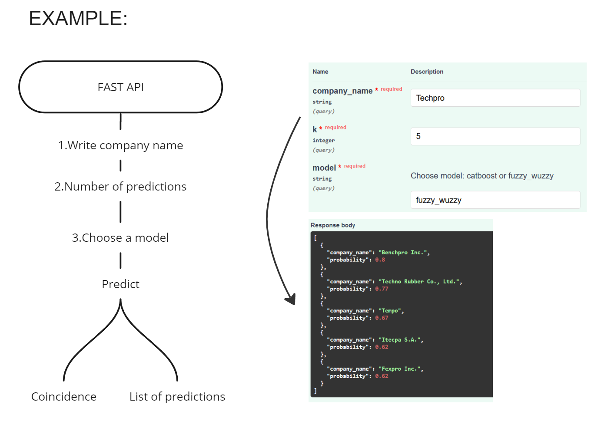

# Matching Of Duplicate Company Names


## Installation

``` shell
# apt install required packages:
sudo apt update
sudo apt install -y zip htop pipenv
  
# clone repo:
git clone https://github.com/SashaMogilevskii/duplicate_names.git

# go to the folder:
cd duplicate_names

# create virtualenv:
pipenv install

# activate virtualenv:
pipenv shell

# run main.py:
cd src
pipenv run main.py

```

## Run 

``` shell
cd src
pipenv run main.py

```

## Architecture & example
<p align="center"></p>


## Experiments setup
- Hardware
    - CPU count: 1
    - GPU count: 3
    - GPU type: Tesla T4 / Tesla A16 / GTX 1070TI (with CatBoost)

- Training data (in folder data):
    - Ex.1 (database.csv) with unique values name_1
    - Ex.2 (database.csv) with unique values name_1_upd

## Preprocessing 

 - name_1_upd - unique values after processing.
 - Preprocessing (services.py):
    - convert string to english
    - replace symbols
    - drop popular stop_words


## Our results:

| Model                     | Data          | f1   | Recall | Presicion |
|---------------------------|---------------|------|--------|-----------|
| fuzzywuzzy                | Ex.1          | 0.21 | ----   | ----      |
| fuzzywuzzy                | Ex.1 (unique) | 0.42 | ----   | ----      |
| tf_idf(400) + LR          | Ex.1 (unique) | 0.54 | 0.43   | 0.92      |
| tf_idf(400) + LR          | Ex.2 (unique) | 0.63 | 0.48   | 0.92      |
| tf_idf(400) + CatBoost    | Ex.2 (unique) | 0.78 | 0.52   | 0.94      |
| tf_idf(550) + CatBoost    | Ex.2 (unique) | 0.78 | 0.54   | 0.94      |
| fuzzywuzzy(PARTIAL_RATIO) | Ex.2 (unique) | 0.56 | 0.47   | ----      |
| RoBERTa (4 epochs)        | Data con_engl | 0.96 | 0.96   | 0.96      |

## Tree

``` shell
.gitattributes
.gitignore
.pre-commit-config.yaml
LICENSE
Pipfile
Pipfile.lock
README.md
pylama.ini
pyproject.toml
mypy.ini
data
   |-- data.csv
   |-- data_v2_10_oct.csv
   |-- data_v2_19_oct.csv
   |-- database.csv
models
   |-- __init__.py
   |-- catboost.pkl
   |-- tfidf1.pkl
notebooks
   |-- Baseline.ipynb
   |-- Baseline_model.ipynb
   |-- Baseline_model_10_20_CatBoost_unique.ipynb
   |-- Baseline_model_19_10(TF-IDF)).ipynb
   |-- Baseline_model_19_10.ipynb
   |-- Bert_model.ipynb
   |-- EDA  & Transform data(19_10).ipynb
   |-- EDA  & Transform data.ipynb
   |-- Model_10_22_CatBoost_unique.ipynb
   |-- Model_RoBERTa.ipynb
src
   |-- configs
   |   |-- config.py
   |-- image
   |   |-- image_1.png
   |-- main.py
   |-- models
   |   |-- __init__.py
   |   |-- base_model.py
   |   |-- catboost_model.py
   |   |-- fuzzywuzzy_model.py
   |-- preprocessing.py
   |-- pydantic_models.py
   |-- services
   |   |-- __init__.py
   |   |-- detection.py
```

## Contributors

1. Шакиров Ренат
2. Набатчиков Илья
3. Могилевский Саша

``` shell
For contributing please use linterts and hooks the following commands:

black .
pre-commit run --all-files
 ```
